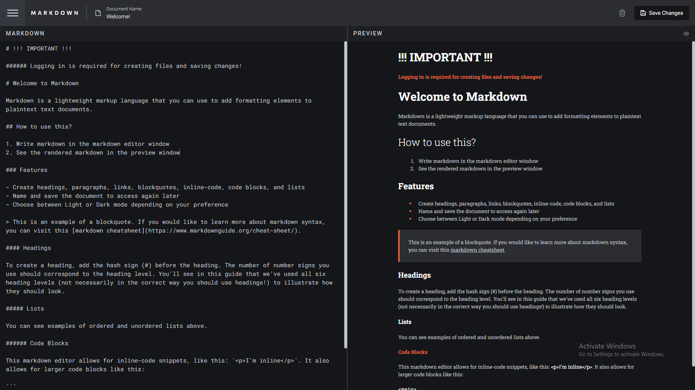
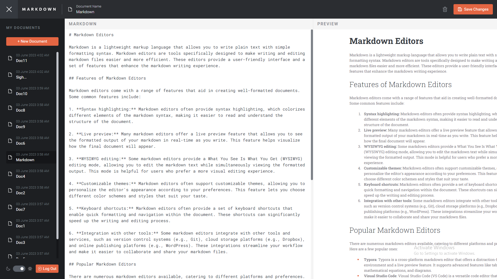
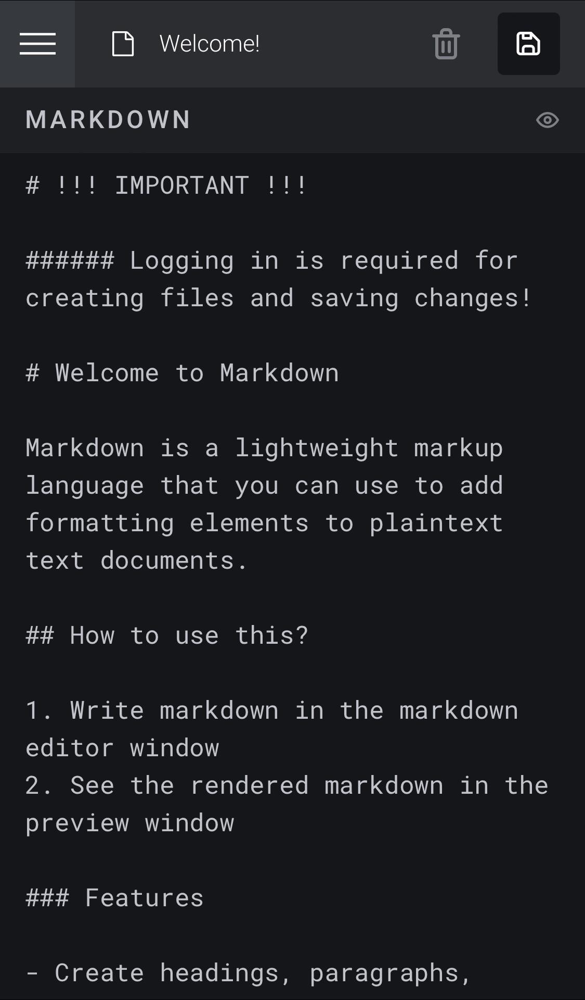
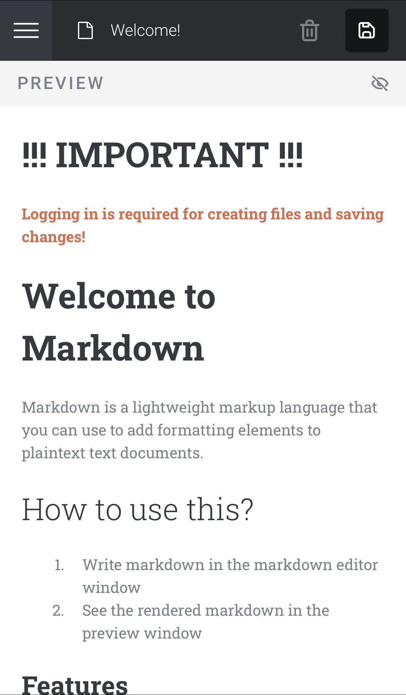
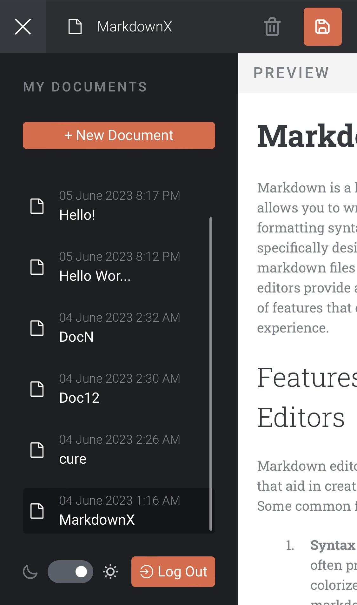

# Connect Four Game

This is a solution to Frontend Mentor's [In-browser markdown editor challenge](https://www.frontendmentor.io/challenges/inbrowser-markdown-editor-r16TrrQX9) with bonus added functionality.

## Links

- <a href="https://markdown-editor-omaralseddik.vercel.app/" target="_blank">Live Link</a>
- <a href="https://www.frontendmentor.io/solutions/fullstack-firebase-nextjs-typescript-tailwind-mPvtlQAti4" target="_blank">Solution Link</a>

## Features

- A fully-functional full-stack markdown editor!
- Users can create, read, update, and delete files with minimal loading times.
- Has a light / dark theme functionality that utilizes the local storage.
- Sleek design. Minor changes to the original has been made to improve the user experience.
- Fully responsive design.

## Tech Stack

- Next.js
- TypeScript
- Tailwind
- Firebase
- react-firebase-hooks
- auto-animate
- react-markdown
- react-syntax-highlighter

## Desktop Screenshots

  
  

## Mobile Screenshots

  
  
  

